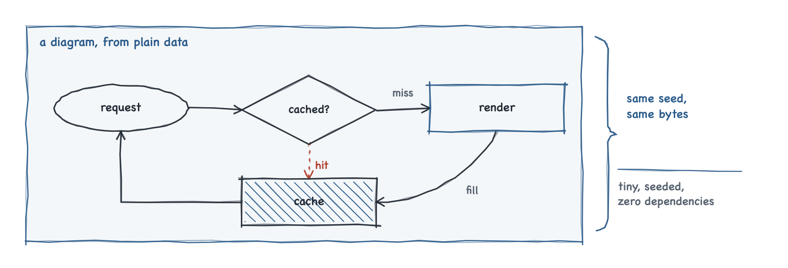

# pensketch

> Hand-sketched SVG diagrams from plain data. Tiny, seeded, zero dependencies.

<picture>
  <source media="(prefers-color-scheme: dark)" srcset="docs/assets/hero-dark.png">
  
</picture>

## Why pensketch

- **A diagram is data.** A plain object, in your repository, that reviews and
  diffs like the code it describes.
- **Determinism is the contract.** Same data, same seed, same package version,
  same engine, same bytes - so a diagram can be snapshot-tested like anything
  else.
- **Tiny and dependency-free.** The core is about 3 KB minified and gzipped,
  and adds nothing else to your lockfile.
- **Themed with CSS variables.** Colors are `var(--ps-*)` references, so dark
  mode is a variable the page redefines rather than a diagram it redraws.

## Install

```sh
npm install @pensketch/core
```

The React bindings are a separate package. `react` is a peer dependency
(`^18 || ^19`), so the bindings draw with the copy your app already has:

```sh
npm install @pensketch/react @pensketch/core
```

## Quickstart: vanilla

Give `draw` an `<svg>` and a diagram. It empties the element first, so calling
it again is a redraw rather than an overlay.

```html
<svg id="flow" viewBox="0 0 700 150" role="img" aria-label="Request flow"></svg>
<script type="module">
  import { draw } from '@pensketch/core';

  draw(document.getElementById('flow'), {
    nodes: [
      { id: 'in',   shape: 'pill',    x: 40,  y: 50, w: 160, h: 50, lines: ['request'] },
      { id: 'gate', shape: 'diamond', x: 260, y: 35, w: 150, h: 80, lines: ['allowed?'] },
      { id: 'work', shape: 'box',     x: 480, y: 50, w: 180, h: 50, lines: ['do the work'], accent: true },
    ],
    edges: [
      { from: ['in', 'r'],   to: ['gate', 'l'] },
      { from: ['gate', 'r'], to: ['work', 'l'], label: 'yes', lx: 445, ly: 60 },
      { from: ['gate', 'b'], to: ['in', 'b'], via: [[335, 135], [120, 135]],
        dotted: true, label: 'no', lx: 225, ly: 122 },
    ],
  }, { seed: 7 });
</script>
```

## Quickstart: React

`<PenSketch>` renders the bare `<svg>` and fills it in an effect, so the server
sends the element and the client draws into it after hydration.

```tsx
import { PenSketch } from '@pensketch/react';
import type { Diagram } from '@pensketch/core';

const FLOW: Diagram = {
  nodes: [
    { id: 'in',   shape: 'pill',    x: 40,  y: 50, w: 160, h: 50, lines: ['request'] },
    { id: 'gate', shape: 'diamond', x: 260, y: 35, w: 150, h: 80, lines: ['allowed?'] },
    { id: 'work', shape: 'box',     x: 480, y: 50, w: 180, h: 50, lines: ['do the work'], accent: true },
  ],
  edges: [
    { from: ['in', 'r'],   to: ['gate', 'l'] },
    { from: ['gate', 'r'], to: ['work', 'l'], label: 'yes', lx: 445, ly: 60 },
    { from: ['gate', 'b'], to: ['in', 'b'], via: [[335, 135], [120, 135]],
      dotted: true, label: 'no', lx: 225, ly: 122 },
  ],
};

export function Flow() {
  return <PenSketch diagram={FLOW} seed={7} viewBox="0 0 700 150" aria-label="Request flow" />;
}
```

## The drawing model

A diagram is a plain object with four optional arrays, and `draw` walks them in
a fixed order: the `nodes` whose shape is `group`, then `edges`, then the rest
of the `nodes`, then `notes`, then the `raw` callbacks. That order is the
z-order, and since every wobble comes from one seeded sequence, it is also part
of the rendered bytes. Coordinates are yours to choose and stay in the
diagram's own space, the one the viewBox declares: pensketch never measures
text, never fits a box to its label, and never routes an edge around an
obstacle.

### `DiagramNode`

| Field | Type | Default | Meaning |
|---|---|---|---|
| `id` | `string` | required | How edges name this node. Unique within the diagram. |
| `x`, `y` | `number` | required | Top left corner of the node's box. |
| `w`, `h` | `number` | required | Size of the box. |
| `shape` | `'group' \| 'box' \| 'pill' \| 'diamond'` | required | `group` draws a wash, a border and a title behind everything else; the other three trace an outline around the box. |
| `lines` | `string[]` | required on `group`, otherwise unlabelled | Label lines, one `<text>` each. A group's title is drawn unconditionally, so the type demands `lines` there and leaves it optional on the drawn shapes. |
| `size` | `number` | `13.5` | Label font size in px. Drawn shapes only; a group's title is always 14. |
| `accent` | `boolean` | `false` | Stroke in `--ps-pen` rather than `--ps-ink`. Drawn shapes only. |
| `hatch` | `boolean` | `false` | Shade the interior, inset 4 px, in `--ps-pen`. Drawn shapes only. |

### `DiagramEdge`

| Field | Type | Default | Meaning |
|---|---|---|---|
| `from` | `[string, Side]` | required | The node to leave, and which side to leave from. |
| `to` | `[string, Side]` | required | The node to reach, and which side the arrowhead lands on. |
| `out` | `number` | `30` | Self-transitions only: how far the loop projects beyond its side. |
| `span` | `number` | `40` | Self-transitions only: how far apart the loop's two anchors sit along that side. |
| `via` | `Point[]` | none | Corner points between the two anchors. `draw` throws when corners are given with `bow`, and on a self-transition, whose path its side, `out` and `span` already settle. An empty array names no corner and is accepted anywhere. |
| `bow` | `number` | `0` | Bow the arrow off the straight line between its anchors, in px. Positive is to the right of travel, so an edge and its reverse bow apart rather than overlapping. Refused alongside corners in `via`, on a self-transition, and for a value that is not a finite number. |
| `dotted` | `boolean` | `false` | Dash the line and recolor it, and its label, to `--ps-accent`. |
| `label` | `string` | none | One line of text. Requires `lx` and `ly`. |
| `lx`, `ly` | `number` | none | Where the label sits. `draw` throws when `label` is set and these are not numbers. |
| `anchor` | `'start' \| 'middle' \| 'end'` | `'middle'` | Which end of the label sits on `lx`. |

### `DiagramNote`

| Field | Type | Default | Meaning |
|---|---|---|---|
| `x` | `number` | required | Horizontal origin of the text; `anchor` says which end of it sits here. |
| `y` | `number` | required | Vertical center of the whole block of lines. |
| `lines` | `string[]` | required | The lines of the note, one `<text>` each, in `--ps-accent`. |
| `anchor` | `'start' \| 'middle' \| 'end'` | `'start'` | Which end of the text sits on `x`. |
| `arrowFrom` | `Point` | none | Where the pointer arrow starts. |
| `via` | `Point[]` | none | Corner points along that arrow. Refused with `bow`, as on an edge, unless the array is empty. |
| `arrowTo` | `Point` | none | Where the arrow ends. The arrow is drawn only when both ends are given. |
| `bow` | `number` | `0` | Bow the pointer off the straight line between its two ends, in px, with the meaning `bow` carries on an edge, and refused with `via` the same way. |

### `Diagram`

| Field | Type | Default | Meaning |
|---|---|---|---|
| `nodes` | `DiagramNode[]` | `[]` | Groups, drawn first and behind everything; the drawn shapes, after the edges. |
| `edges` | `DiagramEdge[]` | `[]` | Arrows, over the groups and under the shapes they connect. |
| `notes` | `DiagramNote[]` | `[]` | Annotations, over everything but the raw callbacks. |
| `raw` | `Array<(pen: Pen) => void>` | `[]` | The escape hatch, run last. Each callback is handed the same pen the rest of the diagram was drawn with, mid-sequence. |

An edge names its ends by side rather than by coordinate, so moving or resizing
a node carries everything attached to it:

| `Side` | Anchor |
|---|---|
| `t` | Top edge, halfway across |
| `b` | Bottom edge, halfway across |
| `l` | Left edge, halfway down |
| `r` | Right edge, halfway down |

The `via` points are used exactly as given, in order, between the two anchors:
the arrow walks the legs you describe, and nothing else is inferred.

## The pen

`pen(svg, options)` returns the drawing surface `draw` uses internally. Reach
for it when a picture is not a diagram, or when a diagram needs one thing the
data model does not describe - the same pen is handed to every callback in a
diagram's `raw` array.

```js
import { pen } from '@pensketch/core';

const p = pen(document.querySelector('svg'), { seed: 3 });
p.rect(20, 20, 200, 90);
p.label(120, 65, 'hand-drawn box');
p.arrow([[220, 65], [320, 65]]);
p.pill(320, 40, 150, 50);
p.label(395, 65, ['a pill', '(two lines)']);
```

| Method | Draws |
|---|---|
| `stroke(pts, opts?)` | A polyline through the points, jittered and traced twice. |
| `arrow(pts, opts?)` | The same, plus two barbs at the last point. |
| `rect(x, y, w, h, opts?)` | Four independent sides, each overshooting its corners. |
| `pill(x, y, w, h, opts?)` | An ellipse inscribed in the box. |
| `arc(cx, cy, rx, ry, from, to, opts?)` | An elliptical arc around a centre point, swept between two angles in radians. |
| `diamond(x, y, w, h, opts?)` | A diamond through the midpoints of the box's sides. |
| `hatch(x, y, w, h, color?)` | Diagonal shading across the box, clipped to it. |
| `label(x, y, lines, opts?)` | One `<text>` per line, centered on the point. |
| `wash(x, y, w, h, fill?)` | A plain rounded background rect. |
| `rng()` | The pen's seeded PRNG; calling it advances the sequence. |

Every call consumes numbers from that sequence, so the order of the calls is
part of the output.

## Theming

Colors are written into the SVG as `var(--ps-*, fallback)` references, so a
page restyles a diagram that is already on screen - dark mode included - just
by redefining the variables. The packages ship no CSS of their own.

| Variable | Default | Used for |
|---|---|---|
| `--ps-ink` | `#232B36` | Primary strokes and labels |
| `--ps-pen` | `#2B5B8A` | Group borders and accent nodes |
| `--ps-accent` | `#B3402E` | Dotted edges and notes |
| `--ps-muted` | `#5A6572` | Secondary labels |
| `--ps-wash` | `rgba(43,91,138,.05)` | Group backgrounds |

```css
:root {
  --ps-ink: #232B36;
  --ps-pen: #2B5B8A;
  --ps-accent: #B3402E;
  --ps-muted: #5A6572;
  --ps-wash: rgba(43, 91, 138, .05);
}
@media (prefers-color-scheme: dark) {
  :root {
    --ps-ink: #D9DFE7;
    --ps-pen: #7FA9DB;
    --ps-accent: #DB8570;
    --ps-muted: #93A0AD;
    --ps-wash: rgba(127, 169, 219, .07);
  }
}
/* the hand-drawn feel depends on a handwriting font for labels */
svg text {
  font-family: "Chalkboard SE", "Bradley Hand", "Segoe Print", "Comic Sans MS", cursive;
}
```

Labels inherit the page's font, and the hand-drawn look leans on the
handwriting stack above: the shapes wobble on their own, but text in a UI font
gives the drawing away. Everything else about the aesthetic is fixed - the
jitter, the double stroke, the corner overshoot - because the look is the
product rather than a set of knobs.

## Determinism and testing your diagrams

Every wobble comes from one seeded PRNG, and nothing in either package reads
`Math.random`, the clock, the locale, or the network. A seed is therefore a
choice of drawing rather than a source of noise: seed 7 and seed 8 are two
different hands writing the same diagram, and each of them writes it the same
way forever. Pick the one you like and commit it.

The version policy makes that promise checkable. A patch release renders
byte-identical output for the same diagram, seed and JavaScript engine build; a
minor release may move the drawing, and its changelog entry says so, so a
snapshot that moved always has a version to point at.

The engine is part of that list because it has to be. Trigonometry is where a
diagram's wobble ends up, and the standard leaves those functions approximate,
so two engines - or one engine across a major upgrade - may differ in the last
digit. Compare snapshots taken the same way: a diagram rendered in a browser
and the same diagram rendered under jsdom are not byte-comparable.

That is what makes a rendered `<svg>` worth snapshotting:

```ts
// @vitest-environment jsdom
import { expect, test } from 'vitest';
import { draw } from '@pensketch/core';
import { FLOW } from './flow';

test('flow diagram renders byte-stably', () => {
  const svg = document.createElementNS('http://www.w3.org/2000/svg', 'svg');
  draw(svg, FLOW, { seed: 7 });
  // Same seed + same pensketch version = same bytes. A snapshot diff means
  // either the diagram data changed or a visual-minor upgrade landed.
  expect(svg.outerHTML).toMatchSnapshot();
});
```

## Examples

Every example runs against the local packages, so install and build them
once from the repository root with `npm ci && npm run build`. The two HTML pages need a static server -
browsers refuse ES module imports over `file://` - which `npx serve .` from the
root provides.

| Folder | Shows | Run |
|---|---|---|
| `examples/vanilla/` | **A CI pipeline.** Groups as stages, a gate diamond, three jobs fanning out of one push, and a dotted edge back to the start. | `npx serve .`, then open `/examples/vanilla/` |
| `examples/custom-pen/` | **An order lifecycle.** States as pills, terminal states hatched, and a retry that stays where it is — a self-transition sized by `out` and `span` — plus `pen()` on its own. | `npx serve .`, then open `/examples/custom-pen/` |
| `examples/state-machine/` | **An ATM.** A decision that splits the flow, a dotted retry routed back down the left margin, a keypad loop at the default size, and a transition and its reverse bowed apart rather than drawn on one line. | `npx serve .`, then open `/examples/state-machine/` |
| `examples/react/` | **The OAuth 2.0 authorization code flow.** Four lanes, seven steps, and a seed control: same data, a different drawing of it, on demand. | `cd examples/react && npm install && npm run dev` |

## Generating diagrams programmatically

When a script or an agent writes the diagram rather than a person,
[docs/agents.md](docs/agents.md) is the reference: the whole type surface, the
seven things that catch callers out, and the constants worth designing around.
It exists because the mistakes that matter here — a label drawn through by its
own connector, a box narrower than its text — are invisible to the type system,
and whoever is writing the data may not be looking at the result.

[A JSON Schema](packages/core/schema/diagram.schema.json) is generated from the
types, so data can be validated before anything is drawn. It covers the
JSON-serialisable half of a diagram: `raw` holds functions, and no file carries
one. It ships in the package, so a validator can load the schema for the
version actually installed:

```js
import schema from '@pensketch/core/schema.json' with { type: 'json' };
```

### Checking a diagram before you draw it

The mistakes that matter here are the ones neither the types nor the schema
can see: a box drawn over another box, a label a connector runs through, text
wider than the box holding it. `check` finds them in the data, without
rendering anything.

```js
import { check } from '@pensketch/core/check';

for (const f of check(diagram, { viewBox: [0, 0, 880, 340] }))
  console.log(f.severity, f.rule, f.message, f.at);
```

| rule | fires when | default |
|---|---|---|
| `duplicate-id` | two nodes share an `id` | **error** |
| `node-overlap` | two node boxes share area | **error** |
| `out-of-bounds` | a box, a point along the line an edge draws, or a label lies outside the `viewBox` | **error** |
| `label-collision` | a label sits within `clearance` of a connector | warning |
| `text-overflow` | the widest line is wider than its box allows | warning |
| `group-escape` | a node is half inside a group | warning |
| `orphan-node` | no edge names a node | warning |
| `edge-overlap` | two edges are drawn on top of one another the whole way | warning |

Every rule can be raised, lowered or switched off:
`check(diagram, { rules: { 'orphan-node': 'off' } })`. Findings come back
sorted by severity, then rule, then position, so the same diagram always
produces the same array and it can be snapshot-tested.

`out-of-bounds` runs only when you pass a `viewBox` — it is the one thing not
decidable from the diagram alone. It measures the line that gets drawn: a loop
and a bow are sampled, so a curve that swings out of the frame is reported
where it leaves, rather than passing because both its anchors are inside.

**Two rules rest on an estimate.** Text is never measured, so `check`
approximates width as `length × fontSize × 0.55`, a figure measured against
the documented handwriting stack and deliberately wider than every real label
in it. It over-states, so it warns early rather than missing an overflow, and
any finding that depends on it carries `estimated: true`. All-capitals text
runs near 0.99 and needs `glyphWidth` raised.

This repository runs the checker over its own examples and its README image
on every push, because rules the author's own diagrams break are rules nobody
else will keep.

### For an agent: the MCP server

`@pensketch/mcp` puts all of this behind three tools — `check_diagram`,
`render_diagram`, `render_png` — and serves the reference, the schema and
four worked examples as resources:

```sh
claude mcp add pensketch -- npx -y @pensketch/mcp@0.1.1
```

`render_png` matters more than it sounds: an agent handed
`<path d="M40 90 C41.2 88.7…">` is reading a few thousand numbers, not looking
at a picture. Its text is drawn in a stand-in face, so it is authoritative
about structure and `check_diagram` remains the authority on fit —
[packages/mcp/README.md](packages/mcp/README.md) explains why.

### Rendering where there is no DOM

`draw` needs an `<svg>` element to fill. A build step, a CI job or a server
has none, so `renderToString` draws through a DOM shim instead - the same
renderer, the same seeded sequence, the same bytes:

```js
import { renderToString } from '@pensketch/core/server';

const svg = `<svg xmlns="http://www.w3.org/2000/svg" viewBox="0 0 700 150"
  role="img" aria-label="Request flow">${renderToString(diagram, { seed: 7 })}</svg>`;
```

What comes back is the contents of an `<svg>`, not the element - you supply
the wrapper, as `draw` requires one. A test asserts its output against a real
DOM rendering the same diagram, because a second renderer that quietly
disagreed would break the byte-parity promise in silence.

## In case you wonder about pensketch vs. rough.js

Both draw hand-sketched graphics. They differ in what you hand them, and every
other difference follows from that one.

- **rough.js hands you a pen.** `line`, `rectangle`,
  `circle`, `path`, `arc` - you compose the picture stroke by stroke, and it
  will draw a great deal pensketch cannot.
- **pensketch takes the finished description.** Nodes, edges and notes as one
  plain object; it decides every stroke.

Which is why a pensketch diagram is a *file* rather than a function. It reviews
in a pull request, diffs a line at a time, and can be generated from data you
already have - none of which is true of code that draws.

| | pensketch | rough.js |
|---|---|---|
| You supply | A diagram object: nodes, edges, notes | Drawing calls you compose yourself |
| It draws | Boxes, pills, diamonds, groups, arrows, labels, hatching | Any shape: lines, curves, arcs, paths, fills |
| Renders to | SVG | SVG and Canvas |
| Size, min+gzip | **3468 B** | 8919 B |
| Dependencies | **none** | four |
| Seeding | `seed` per diagram, and a patch release renders byte-identical output by policy | `seed` per shape, plus `rough.newSeed()` |
| Theming | `var(--ps-*)` references, so a page restyles a diagram already on screen | Per-call options, with instance defaults |
| Layout | You give coordinates | You give coordinates |

Sizes are each project's published ESM bundle, minified and gzipped; rough.js
measured at 4.6.6.

**Reach for pensketch** when the picture is boxes and arrows that belong in
version control: one plain object your reviewers can read, rendering to the
same bytes on every run, for about 3 KB and no new entries in your lockfile.

**Reach for rough.js** when the picture is arbitrary - a sketchy chart, a game,
a texture, anything worth composing stroke by stroke, on canvas or SVG.

## License

MIT, copyright Anas K. See [LICENSE](LICENSE).
